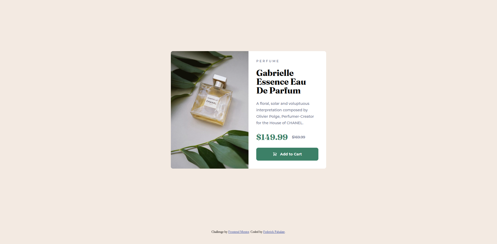

# Frontend Mentor - Product preview card component solution

This is a solution to the [Product preview card component challenge on Frontend Mentor](https://www.frontendmentor.io/challenges/product-preview-card-component-GO7UmttRfa). Frontend Mentor challenges help you improve your coding skills by building realistic projects.

## Table of contents

- [Overview](#overview)
  - [The challenge](#the-challenge)
  - [Screenshot](#screenshot)
  - [Links](#links)
- [My process](#my-process)
  - [Built with](#built-with)
  - [What I learned](#what-i-learned)
  - [Continued development](#continued-development)
  - [Useful resources](#useful-resources)
- [Author](#author)

## Overview

### The challenge

Users should be able to:

- View the optimal layout depending on their device's screen size
- See hover and focus states for interactive elements

### Screenshot



### Links

- Solution URL: [https://www.frontendmentor.io/solutions/responsive-product-preview-card-Do4ltC0_op](https://www.frontendmentor.io/solutions/responsive-product-preview-card-Do4ltC0_op)
- Live Site URL: [https://federick-pabalate.github.io/frontendmentor-product-review-card/](https://federick-pabalate.github.io/frontendmentor-product-review-card/)

## My process

### Built with

- Semantic HTML5 markup
- CSS custom properties
- Flexbox
- CSS Grid
- Mobile-first workflow

### What I learned

In this challenge I found new html tag element called picture. Element picture helps me with specifying a resource to an image element and make image responsive.

Code snippets:

```html
<picture>
  <source
    media="(min-width:768px)"
    srcset="./assets/images/image-product-desktop.jpg"
  />
  <source
    media="(min-width:320px)"
    srcset="./assets/images/image-product-mobile.jpg"
  />
  
</picture>
```

### Continued development

In my incoming project I'll make sure to design the layout to work across all devices.

### Useful resources

- [HTML - <picture> element](https://developer.mozilla.org/en-US/docs/Web/HTML/Reference/Elements/picture) - This helped me for specifying a image resource based on screen sizes.

## Author

- Frontend Mentor - [https://www.frontendmentor.io/profile/federick-pabalate](https://www.frontendmentor.io/profile/federick-pabalate)
- Github - [https://github.com/federick-pabalate](https://github.com/federick-pabalate)
